<div align="center">

# 🐺 Wolf Fun

**Smart AI Farm Management**

[](https://unity.com/)
[](https://docs.microsoft.com/en-us/dotnet/csharp/)
[](LICENSE)


*Build your automated farm empire with intelligent AI workers*

</div>

---

## ✨ What Makes It Special

<table>
<tr>
<td width="50%">

### 🤖 **Zero-Effort Automation**
Your workers think for themselves. They find tasks, navigate obstacles, and complete work without micromanagement.

</td>
<td width="50%">

### 📈 **Strategic Growth** 
Focus on big decisions while AI handles the details. Buy land, hire workers, optimize profits.

</td>
</tr>
</table>

---

## 🎮 Core Features

<details>
<summary><strong>🌱 Smart Farming System</strong></summary>

- **3 Crop Types**: Tomatoes, Blueberries, Strawberries
- **Auto-Harvest**: Workers know when crops are ready
- **Growth Visualization**: Watch your farm come alive


</details>

<details>
<summary><strong>🧠 AI Worker Intelligence</strong></summary>

```
🔄 IDLE → 🚶 MOVING → ⚒️ WORKING → 🔄 IDLE
```

Workers autonomously:
- Find available tasks
- Navigate using Unity NavMesh
- Complete work efficiently
- Return to base when done


</details>

<details>
<summary><strong>🐄 Passive Income Streams</strong></summary>

- **Dairy Cows**: Milk production every few minutes
- **Set & Forget**: No manual management required
- **Scaling Profits**: More cows = more money


</details>

<details>
<summary><strong>💰 Economic Strategy</strong></summary>

| Action | Cost | Benefit |
|--------|------|---------|
| Seeds | 50-100g | Crop production |
| Workers | 500g | Task automation |
| Equipment | 1000g+ | Efficiency boost |

**Win Condition**: Reach 1,000,000 gold! 🏆


</details>

---

## ⚡ Quick Start

<div align="center">

### Requirements
  

</div>

```bash
# Clone & Play in 3 steps
git clone https://github.com/tsan2711/wolf-fun.git
cd wolf-fun
# Open in Unity 6 → MainMenu scene → Press Play
```

<div align="center">

🎯 **New Game** → 🌱 **Plant Seeds** → 👷 **Hire Workers** → 💰 **Profit!**


</div>

---

## 🔧 Under the Hood

```mermaid
graph LR
    A[🤖 Worker AI] --> B[🎯 Task Detection]
    B --> C[🗺️ NavMesh Pathfinding]
    C --> D[⚒️ Task Execution]
    D --> A
```

<div align="center">



</div>

### State Machine Magic

```csharp
// Clean, simple AI behavior
public class WorkerStateMachine {
    Idle → Moving → Working → Idle
    
    // Workers decide what to do next
    HasTask() && !AtTarget() → Moving
    AtTarget() → Working
    TaskComplete() → Idle
}
```

### Performance Features
- ⚡ **Object Pooling** - Smooth 60+ FPS
- 🎯 **Event-Driven UI** - Updates only when needed  
- 🧭 **Optimized Pathfinding** - Smart navigation

---

## 🎮 Gameplay Tips

<div align="center">

| 🥇 **Beginner** | 🥈 **Intermediate** | 🥉 **Expert** |
|----------------|-------------------|---------------|
| Start with tomatoes | Mix crop types | Optimize worker ratios |
| Buy 2-3 workers | Focus on equipment | Strategic plot placement |
| Manual oversight | Trust the AI | Full automation |

</div>

---

## 🛠️ Developer Tools

> **Debug Commands** - Right-click worker in Scene view

```csharp
[ContextMenu("🔄 Reset to Idle")]     // Fix stuck workers
[ContextMenu("📊 Print State")]       // Debug current status  
[ContextMenu("✅ Complete Task")]      // Force task completion
```

---

## 📥 Download

<div align="center">

[](https://github.com/tsan2711/wolf-fun/releases/download/v1.0/tansang-wolf-fun-testing-windows-v1.0.zip)
[](https://github.com/tsan2711/wolf-fun/releases/download/v1.0/tansang-wolf-fun-testing-macos-v1.0.zip)

**System Requirements**: Windows 10+ or macOS 10.15+ • 4GB RAM • DirectX 11

</div>

---

## 🎮 Gameplay Videos

<div align="center">

### 🤖 AI Workers in Action

https://github.com/user-attachments/assets/1d5d1c07-8b78-4ca7-9aea-dac4414171c4

### 🌱 Farm Management Showcase  

https://github.com/user-attachments/assets/8e4ded7b-2a68-421c-b111-27c02bfbd445

*Watch the intelligent AI system automate your entire farm operation*

</div>

---

<div align="center">

### Made with 💜 using Unity 6


**[⭐ Star this repo](https://github.com/tsan2711/wolf-fun) if you found it useful!**

</div>
